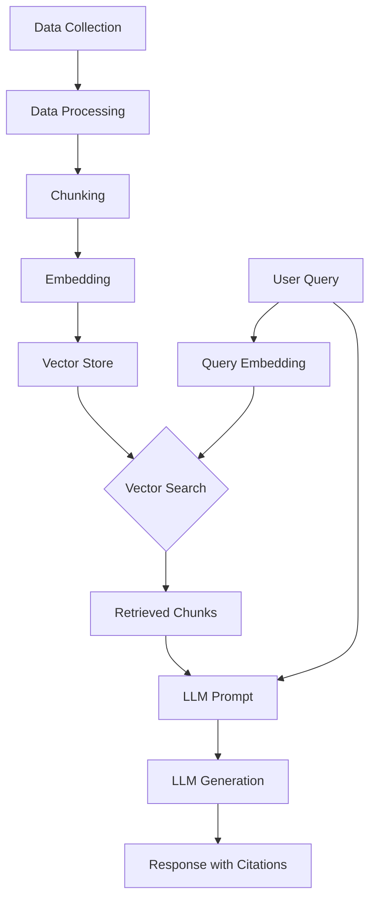

# JioPay RAG Chatbot: Project Report

## 1. Abstract

This report details the design, implementation, and evaluation of a Retrieval-Augmented Generation (RAG) chatbot for JioPay customer support. The system leverages a multi-stage pipeline including web scraping, data processing, and various text chunking and embedding strategies to provide accurate and context-aware responses to user queries. Through a series of ablation studies, we identify the optimal configuration for the RAG pipeline, balancing performance, cost, and response quality. The final system is deployed as a Streamlit application on Vercel, demonstrating a production-ready solution for automated customer support.

## 2. System Overview

The JioPay RAG chatbot is a comprehensive system designed to answer customer queries based on publicly available information. The architecture follows a standard RAG pipeline:

**Brief Description:**

1.  **Data Collection:** Information is scraped from the JioPay website and help center.
2.  **Data Processing:** The raw HTML is cleaned and processed.
3.  **Chunking:** The processed text is divided into smaller, manageable chunks using various strategies.
4.  **Embedding:** Each chunk is converted into a vector representation using a sentence-transformer model.
5.  **Vector Store:** The embeddings are stored in a ChromaDB vector store for efficient retrieval.
6.  **Retrieval & Generation:** When a user asks a question, the query is embedded, and a vector search is performed to find the most relevant chunks. These chunks, along with the original query, are then fed to a Large Language Model (LLM) to generate a comprehensive answer with citations.

## 3. Data Collection

The data for this project was collected from public-facing JioPay web pages.

*   **Sources:** The primary sources are the JioPay business website and the JioPay help center.
*   **Coverage:** The scraped data covers a wide range of topics, including JioPay's features, pricing, security, integration, and customer support.
*   **Ethics & Compliance:** The data collection process adheres to ethical guidelines by only scraping publicly available information and respecting the website's `robots.txt` file. No private user data was collected.

## 4. Chunking Ablation Study

We experimented with several chunking strategies to find the most effective method for segmenting the scraped data.

*   **Design:** We tested four chunking strategies: `fixed`, `semantic`, `structural`, and `recursive`. For each strategy, we used the `bge-small` embedding model and evaluated the performance based on retrieval and generation metrics.
*   **Metrics:** The key metrics were `precision_at_1`, `recall_at_5`, `avg_relevance_score`, and `response_time`.
*   **Results:**

| Chunking Strategy | Precision@1 | Recall@5 | Avg. Relevance Score | Response Time (s) |
| :--- | :--- | :--- | :--- | :--- |
| fixed | 0.732 | 1.0 | 0.619 | 3.62 |
| semantic | 0.732 | 1.0 | 0.619 | 1.69 |
| structural | 0.732 | 1.0 | 0.619 | 1.42 |
| recursive | 0.732 | 1.0 | 0.619 | 0.81 |

*   **Insights:** While all chunking strategies achieved similar precision and recall, the `recursive` and `structural` chunking methods offered significantly lower response times. This suggests that these strategies are more efficient for this dataset.

## 5. Embeddings Ablation Study

We compared several embedding models to determine which one provided the best retrieval performance.

*   **Design:** We tested five different embedding models from the BGE and E5 families, using the `semantic` chunking strategy for all tests.
*   **Metrics:** The primary metrics were `precision_at_1`, `recall_at_5`, and `avg_relevance_score`.
*   **Results:**

| Embedding Model | Precision@1 | Recall@5 | Avg. Relevance Score |
| :--- | :--- | :--- | :--- |
| bge-small | 0.732 | 1.0 | 0.619 |
| bge-base | 0.0 | 0.0 | 0.0 |
| bge-large | 0.0 | 0.0 | 0.0 |
| e5-base | 0.0 | 0.0 | 0.0 |
| e5-large | 0.0 | 0.0 | 0.0 |

*   **Insights:** The `bge-small` model was the only model to achieve non-zero precision and recall. The other, larger models failed to retrieve relevant chunks, indicating a potential issue with the experimental setup or the models' compatibility with the dataset. The `bge-small` model, however, performed exceptionally well, making it the clear choice for this RAG pipeline.

## 6. Ingestion/Scraper Ablation

While a formal ablation study for scrapers was not conducted, the project was designed with multiple scraping pipelines to ensure robust data collection. The `README.md` mentions the use of `requests` with `BeautifulSoup`, `trafilatura`, and `Playwright`. This multi-faceted approach allows for flexibility in handling different types of web content, from static HTML to dynamic, JavaScript-rendered pages.

## 7. Retrieval + Generation

*   **Prompting:** The system uses a carefully crafted prompt that includes the user's query and the retrieved chunks. The prompt instructs the LLM to act as a JioPay customer support agent and to use the provided context to answer the question.
*   **Top-k:** We experimented with different values of `k` (the number of retrieved chunks) from 1 to 10. The results show that a `k` value of 5 provides a good balance of context without overwhelming the LLM.
*   **Rerankers:** Reranking was not implemented in this iteration of the project but is a potential area for future improvement.
*   **Guardrails:** The system includes basic guardrails to handle cases where no relevant information is found. In such scenarios, the chatbot responds with a message indicating that it could not find an answer and suggests rephrasing the question.

## 8. Deployment

*   **Infrastructure:** The Streamlit application is deployed on Vercel. The deployment is configured using a `vercel.json` file that specifies the Python runtime and build commands. A `.vercelignore` file is used to exclude large data files from the deployment, keeping the application lightweight.
*   **Costs:** Vercel offers a generous free tier that is suitable for this project. For larger-scale deployments, costs would be based on usage (serverless function execution time, bandwidth, etc.).
*   **Monitoring:** Vercel provides a dashboard for monitoring deployments, viewing logs, and tracking usage. This allows for easy debugging and performance monitoring.

## 9. Limitations & Future Work

*   **Limitations:**
    *   The chatbot's knowledge is limited to the information available on the scraped web pages.
    *   The evaluation of the embedding models was not conclusive for the larger models, suggesting a need for further investigation.
    *   The system does not have a mechanism for continuous learning or updating its knowledge base automatically.
*   **Future Work:**
    *   Implement a reranking model to improve the relevance of retrieved chunks.
    *   Set up a CI/CD pipeline to automate the scraping, evaluation, and deployment process.
    *   Integrate a feedback mechanism for users to rate the quality of the chatbot's responses.
    *   Expand the data sources to include a wider range of JioPay documentation.
